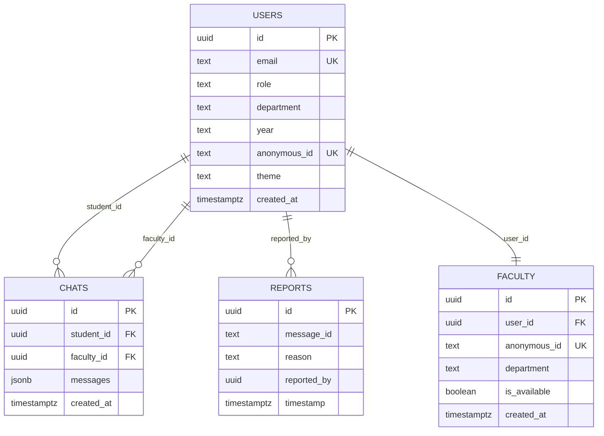

# AnonBridge Backend Documentation

<div align="center">
  <h1>🔧 Backend Architecture & Database Documentation</h1>
  <p><strong>AnonBridge - Secure Anonymous Communication Platform</strong></p>
  <p>Complete guide to the backend infrastructure, database schema, and API operations</p>
</div>

---

## 📋 Table of Contents

1. [Overview](#overview)
2. [Technology Stack](#technology-stack)
3. [Database Schema](#database-schema)
4. [Authentication & Security](#authentication--security)
5. [API Functions](#api-functions)
6. [Row Level Security (RLS)](#row-level-security-rls)
7. [Database Migrations](#database-migrations)
8. [Real-time Features](#real-time-features)
9. [Error Handling](#error-handling)
10. [Performance Optimization](#performance-optimization)
11. [Deployment Guide](#deployment-guide)
12. [Troubleshooting](#troubleshooting)

---

## 🎯 Overview

AnonBridge uses **Supabase** as its Backend-as-a-Service (BaaS) solution, providing:

- **PostgreSQL Database** - Relational database with JSONB support
- **Real-time Subscriptions** - Live updates for chat messages
- **Row Level Security** - Database-level security policies
- **Authentication** - Built-in user management
- **Edge Functions** - Serverless functions (if needed)

### Architecture Principles

- **Privacy First** - Anonymous IDs protect user identity
- **Security by Design** - RLS policies enforce data access rules
- **Real-time Communication** - Instant message delivery
- **Scalable Structure** - Modular database design

---

## 🛠️ Technology Stack

### Backend Services
- **Supabase** - Primary backend platform
- **PostgreSQL 15+** - Database engine
- **PostgREST** - Auto-generated REST API
- **Realtime** - WebSocket connections for live updates

### Client Libraries
- **@supabase/supabase-js** - JavaScript client library
- **React Context** - State management
- **TypeScript** - Type safety

### Security Features
- **Row Level Security (RLS)** - Database-level access control
- **JWT Authentication** - Secure token-based auth
- **Email Validation** - Manipal University domain restriction
- **Anonymous IDs** - Privacy protection

---

## 🗄️ Database Schema

### Core Tables

#### 1. Users Table
Stores user account information with anonymous IDs for privacy.

```sql
CREATE TABLE users (
  id uuid PRIMARY KEY DEFAULT gen_random_uuid(),
  email text UNIQUE NOT NULL,
  role text NOT NULL CHECK (role IN ('student', 'faculty')),
  department text,
  year text, -- Only for students
  theme text DEFAULT 'blue_neon',
  created_at timestamptz DEFAULT now(),
  anonymous_id text UNIQUE NOT NULL,
  contact_number text,
  password text DEFAULT ''
);
```

**Key Features:**
- `anonymous_id`: Generated identifier (e.g., "Student#123", "Faculty#456")
- `email`: Restricted to @manipal.edu and @learner.manipal.edu domains
- `role`: Either 'student' or 'faculty'
- `theme`: User's preferred UI theme

#### 2. Chats Table
Manages conversation threads between students and faculty.

```sql
CREATE TABLE chats (
  id uuid PRIMARY KEY DEFAULT gen_random_uuid(),
  student_id uuid NOT NULL REFERENCES users(id) ON DELETE CASCADE,
  faculty_id uuid REFERENCES users(id) ON DELETE SET NULL,
  messages jsonb[] DEFAULT '{}',
  created_at timestamptz DEFAULT now()
);
```

**Key Features:**
- `messages`: JSONB array storing all conversation messages
- `student_id`: Required reference to student user
- `faculty_id`: Optional reference to faculty user (can be NULL)
- Foreign key constraints ensure data integrity

#### 3. Reports Table
Handles issue reporting and content moderation.

```sql
CREATE TABLE reports (
  id uuid PRIMARY KEY DEFAULT gen_random_uuid(),
  message_id text NOT NULL,
  reason text,
  reported_by uuid DEFAULT gen_random_uuid(),
  timestamp timestamptz DEFAULT now()
);
```

**Key Features:**
- `message_id`: Reference to reported content
- `reason`: Categorized issue type
- `reported_by`: Anonymous reporter ID

#### 4. Faculty Table
Extended faculty information and availability status.

```sql
CREATE TABLE faculty (
  id uuid PRIMARY KEY DEFAULT gen_random_uuid(),
  user_id uuid UNIQUE REFERENCES auth.users(id) ON DELETE CASCADE,
  anonymous_id text UNIQUE NOT NULL,
  department text NOT NULL,
  is_available boolean DEFAULT true,
  created_at timestamptz DEFAULT now()
);
```

### Database Relationships



---

## 🔐 Authentication & Security

### Email Domain Validation
Only Manipal University email addresses are allowed:
- `@manipal.edu` - Faculty and staff
- `@learner.manipal.edu` - Students

### Anonymous ID Generation
```javascript
const generateAnonymousId = (role) => {
  const prefix = role === 'student' ? 'Student' : 'Faculty';
  const randomNum = Math.floor(Math.random() * 899) + 100;
  return `${prefix}#${randomNum}`;
};
```

### Password Security
- Minimum 6 characters required
- Stored securely using Supabase Auth
- No plain text storage

---

## 🔒 Row Level Security (RLS)

### Users Table Policies

```sql
-- Allow anonymous user registration
CREATE POLICY "Allow anonymous user registration" 
ON users FOR INSERT TO anon 
WITH CHECK (true);

-- Allow anonymous users to check existing emails
CREATE POLICY "Allow anonymous users to check existing emails" 
ON users FOR SELECT TO anon 
USING (true);

-- Users can read own data
CREATE POLICY "Users can read own data" 
ON users FOR SELECT TO authenticated 
USING (auth.uid() = id);

-- Users can update own data
CREATE POLICY "Users can update own data" 
ON users FOR UPDATE TO authenticated 
USING (auth.uid() = id) 
WITH CHECK (auth.uid() = id);

-- Users can read user data for chats
CREATE POLICY "Users can read user data for chats" 
ON users FOR SELECT TO authenticated 
USING (true);
```

### Chats Table Policies

```sql
-- Students can create their own chats
CREATE POLICY "Students can create their own chats" 
ON chats FOR INSERT TO authenticated 
WITH CHECK (auth.uid() = student_id);

-- Students can read own chats
CREATE POLICY "Students can read own chats" 
ON chats FOR SELECT TO authenticated 
USING (auth.uid() = student_id);

-- Students can update own chats
CREATE POLICY "Students can update own chats" 
ON chats FOR UPDATE TO authenticated 
USING (auth.uid() = student_id);

-- Faculty can read assigned chats
CREATE POLICY "Faculty can read assigned chats" 
ON chats FOR SELECT TO authenticated 
USING (auth.uid() = faculty_id);

-- Faculty can update assigned chats
CREATE POLICY "Faculty can update assigned chats" 
ON chats FOR UPDATE TO authenticated 
USING (auth.uid() = faculty_id);

-- Allow authenticated users to view chats (for admin)
CREATE POLICY "Allow authenticated users to view chats" 
ON chats FOR SELECT TO authenticated 
USING (true);

-- Allow authenticated users to update chats (for admin)
CREATE POLICY "Allow authenticated users to update chats" 
ON chats FOR UPDATE TO authenticated 
USING (true);

-- Allow authenticated users to create chats (for admin)
CREATE POLICY "Allow authenticated users to create chats" 
ON chats FOR INSERT TO authenticated 
WITH CHECK (true);
```

### Reports Table Policies
```sql
-- Enable RLS
ALTER TABLE reports ENABLE ROW LEVEL SECURITY;

-- Allow authenticated users to create reports
CREATE POLICY "Allow authenticated users to create reports" 
ON reports FOR INSERT TO authenticated 
WITH CHECK (true);

-- Allow authenticated users to view reports (admin access)
CREATE POLICY "Allow authenticated users to view reports" 
ON reports FOR SELECT TO authenticated 
USING (true);
```

---

## 📡 API Functions

### User Management

#### `registerUser(userData)`
Creates a new user account with anonymous ID generation.

**Parameters:**
```typescript
interface UserData {
  email: string;
  role: 'student' | 'faculty';
  department: string;
  year?: string; // Only for students
  contactNumber?: string;
  theme?: string;
}
```

**Implementation:**
```javascript
export async function registerUser({ 
  email, 
  role, 
  department, 
  year = null, 
  contactNumber = null, 
  theme = 'blue_neon' 
}) {
  const anonymousId = generateAnonymousId(role);
  
  const userData = {
    email: email.toLowerCase().trim(),
    role,
    department,
    year: role === 'student' ? year : null,
    anonymous_id: anonymousId,
    theme,
    contact_number: contactNumber
  };

  const { data, error } = await supabase
    .from('users')
    .insert([userData])
    .select()
    .single();

  return { data, error };
}
```

#### `checkUserExists(email)`
Verifies if a user account exists for the given email.

**Returns:**
```typescript
{
  exists: boolean;
  user: User | null;
  error: Error | null;
}
```

### Chat Management

#### `startNewChat(chatData)`
Initializes a new conversation thread between student and faculty.

**Parameters:**
```typescript
interface ChatData {
  studentId: string;
  facultyId: string;
  subject: string;
  department?: string;
  firstMessage?: {
    from: 'student' | 'faculty';
    text: string;
    timestamp?: string;
  };
}
```

**Implementation:**
```javascript
export async function startNewChat({ 
  studentId, 
  facultyId, 
  subject, 
  department = null,
  firstMessage = null 
}) {
  const defaultMessage = {
    from: 'student',
    text: 'Hello, I have a question and would appreciate your guidance.',
    timestamp: new Date().toISOString(),
    id: `msg_${Date.now()}`,
    type: 'text',
    status: 'sent'
  };

  const initialMessage = firstMessage || defaultMessage;

  const chatData = {
    student_id: studentId,
    faculty_id: facultyId,
    messages: [initialMessage]
  };

  const { data, error } = await supabase
    .from('chats')
    .insert([chatData])
    .select(`
      *,
      student:student_id(id, anonymous_id, department, year),
      faculty:faculty_id(id, anonymous_id, department)
    `)
    .single();

  return { data, error };
}
```

#### `appendMessage(messageData)`
Adds a new message to an existing chat thread.

**Parameters:**
```typescript
interface MessageData {
  chatId: string;
  from: 'student' | 'faculty';
  text: string;
  type?: 'text' | 'file' | 'image';
  timestamp?: string;
}
```

**Message Structure:**
```typescript
interface Message {
  id: string;
  from: 'student' | 'faculty';
  text: string;
  type: 'text' | 'file' | 'image';
  timestamp: string;
  status: 'sent' | 'delivered' | 'read';
}
```

#### `getUserChats(userId, role, options)`
Retrieves all chat threads for a specific user.

**Parameters:**
```typescript
interface GetChatsOptions {
  limit?: number;
  offset?: number;
  orderBy?: string;
  ascending?: boolean;
}
```

**Returns:**
```typescript
interface ChatThread {
  id: string;
  student_id: string;
  faculty_id: string;
  messages: Message[];
  created_at: string;
  student: User;
  faculty: User;
  lastMessage: string;
  messageCount: number;
  status: 'active' | 'archived';
}
```

### Reporting System

#### `reportIssue(reportData)`
Submits an issue report for admin review.

**Parameters:**
```typescript
interface ReportData {
  reason: string;
  comment?: string;
  reportedBy: string;
  messageId?: string;
  threadId?: string;
  userRole: 'student' | 'faculty';
}
```

---

## 🔄 Real-time Features

### Supabase Realtime Subscriptions

The application uses Supabase's real-time capabilities for live updates:

```javascript
// Subscribe to chat changes
const chatsSubscription = supabase
  .channel('chats_changes')
  .on('postgres_changes', { 
    event: '*', 
    schema: 'public', 
    table: 'chats' 
  }, (payload) => {
    // Handle real-time chat updates
    handleChatUpdate(payload);
  })
  .subscribe();

// Subscribe to user changes
const usersSubscription = supabase
  .channel('users_changes')
  .on('postgres_changes', { 
    event: '*', 
    schema: 'public', 
    table: 'users' 
  }, (payload) => {
    // Handle real-time user updates
    handleUserUpdate(payload);
  })
  .subscribe();
```

### Real-time Events Handled
- **New Messages** - Instant message delivery
- **User Status Changes** - Online/offline indicators
- **Chat Updates** - Thread modifications
- **Report Submissions** - Admin notifications

---

## 📊 Database Indexes

### Performance Indexes

```sql
-- Users table indexes
CREATE INDEX idx_users_email ON users(email);
CREATE INDEX idx_users_role ON users(role);
CREATE INDEX idx_users_department ON users(department);
CREATE UNIQUE INDEX users_anonymous_id_unique ON users(anonymous_id);

-- Chats table indexes
CREATE INDEX idx_chats_student_id ON chats(student_id);
CREATE INDEX idx_chats_faculty_id ON chats(faculty_id);
CREATE INDEX idx_chats_created_at ON chats(created_at);

-- Reports table indexes
CREATE INDEX idx_reports_timestamp ON reports(timestamp);
CREATE INDEX idx_reports_reason ON reports(reason);
```

---

## 🔧 Database Helper Functions

### File Structure
```
src/lib/database/
├── index.js              # Central export file
├── registerUser.js       # User registration
├── startNewChat.js       # Chat initialization
├── appendMessage.js      # Message handling
├── getUserChats.js       # Chat retrieval
├── reportIssue.js        # Issue reporting
└── README.md            # Database documentation
```

### Function Categories

#### User Operations
- `registerUser()` - Create new user account
- `checkUserExists()` - Verify user existence
- `updateUserProfile()` - Modify user data

#### Chat Operations
- `startNewChat()` - Initialize conversation
- `appendMessage()` - Add message to thread
- `getUserChats()` - Retrieve user's chats
- `getChatMessages()` - Get message history
- `markMessagesAsRead()` - Update read status

#### Administrative Operations
- `reportIssue()` - Submit issue report
- `getAllReports()` - Retrieve all reports (admin)
- `resolveReport()` - Mark report as resolved

---

## 🛡️ Security Implementation

### Data Protection Measures

1. **Anonymous Communication**
   - Real names never stored in messages
   - Anonymous IDs used for all interactions
   - Email addresses protected from other users

2. **Access Control**
   - RLS policies enforce user permissions
   - Students can only access their own chats
   - Faculty can only access assigned conversations

3. **Input Validation**
   - Email domain restrictions
   - Content sanitization
   - SQL injection prevention

4. **Audit Trail**
   - All actions logged with timestamps
   - Report system for abuse detection
   - Admin oversight capabilities

### RLS Policy Examples

```sql
-- Example: Students can only read their own chats
CREATE POLICY "Students can read own chats" 
ON chats FOR SELECT TO authenticated 
USING (auth.uid() = student_id);

-- Example: Faculty can read assigned chats
CREATE POLICY "Faculty can read assigned chats" 
ON chats FOR SELECT TO authenticated 
USING (auth.uid() = faculty_id);
```

---

## 📝 Database Migrations

### Migration File Structure
```
supabase/migrations/
├── 20250702080106_crimson_voice.sql      # Initial users table
├── 20250702081342_super_wind.sql         # Chats table creation
├── 20250702082558_jade_crystal.sql       # Reports table
├── 20250702091042_azure_limit.sql        # RLS policies
├── 20250702091311_floating_glade.sql     # Additional constraints
├── 20250702092718_weathered_coast.sql    # Faculty table
└── fix_chat_rls_policy.sql               # RLS policy fixes
```

### Migration Best Practices

1. **Descriptive Names** - Use meaningful migration names
2. **Incremental Changes** - One logical change per migration
3. **Rollback Safety** - Include rollback instructions
4. **Documentation** - Comment complex operations

### Sample Migration Template
```sql
/*
  # Migration Title
  
  1. New Tables
    - Description of new tables
  
  2. Schema Changes
    - Description of modifications
  
  3. Security
    - RLS policies added/modified
*/

-- Migration SQL here
CREATE TABLE IF NOT EXISTS example_table (
  id uuid PRIMARY KEY DEFAULT gen_random_uuid(),
  created_at timestamptz DEFAULT now()
);

-- Enable RLS
ALTER TABLE example_table ENABLE ROW LEVEL SECURITY;

-- Add policies
CREATE POLICY "policy_name" ON example_table 
FOR SELECT TO authenticated 
USING (auth.uid() = user_id);
```

---

## ⚡ Performance Optimization

### Query Optimization

1. **Efficient Joins**
   ```sql
   -- Good: Use specific columns
   SELECT u.anonymous_id, c.messages 
   FROM chats c 
   JOIN users u ON c.student_id = u.id;
   
   -- Avoid: SELECT * with large JSONB arrays
   ```

2. **JSONB Indexing**
   ```sql
   -- Index for message search
   CREATE INDEX idx_chats_messages_gin ON chats USING gin(messages);
   ```

3. **Pagination**
   ```javascript
   // Implement proper pagination
   const { data } = await supabase
     .from('chats')
     .select('*')
     .range(offset, offset + limit - 1)
     .order('created_at', { ascending: false });
   ```

### Caching Strategies

1. **Client-side Caching**
   - React Context for user data
   - Local state for chat threads
   - Browser storage for preferences

2. **Database Optimization**
   - Proper indexing on frequently queried columns
   - JSONB optimization for message arrays
   - Connection pooling via Supabase

---

## 🚀 Deployment Guide

### Environment Variables

Create a `.env` file with your Supabase credentials:

```env
VITE_SUPABASE_URL=https://your-project.supabase.co
VITE_SUPABASE_ANON_KEY=your-anon-key-here
```

### Supabase Project Setup

1. **Create Project**
   ```bash
   # Visit https://supabase.com/dashboard
   # Create new project
   # Note down URL and anon key
   ```

2. **Run Migrations**
   ```sql
   -- Execute all migration files in order
   -- Or use Supabase CLI:
   supabase db push
   ```

3. **Configure Authentication**
   ```sql
   -- Email confirmation disabled by default
   -- Password requirements: minimum 6 characters
   ```

### Production Checklist

- [ ] Environment variables configured
- [ ] Database migrations applied
- [ ] RLS policies enabled and tested
- [ ] Email domain restrictions active
- [ ] Real-time subscriptions working
- [ ] Error handling implemented
- [ ] Performance monitoring setup

---

## 🐛 Troubleshooting

### Common Issues

#### 1. RLS Policy Violations
**Error:** `new row violates row-level security policy`

**Solution:**
```sql
-- Check current policies
SELECT * FROM pg_policies WHERE tablename = 'chats';

-- Fix policy for chat creation
DROP POLICY IF EXISTS "old_policy_name" ON chats;
CREATE POLICY "Students can create their own chats" 
ON chats FOR INSERT TO authenticated 
WITH CHECK (auth.uid() = student_id);
```

#### 2. Authentication Issues
**Error:** `Invalid JWT token`

**Solutions:**
- Verify Supabase URL and anon key
- Check token expiration
- Ensure user is properly authenticated

#### 3. Message Insertion Failures
**Error:** `Cannot insert message into chat`

**Debug Steps:**
1. Verify chat exists: `SELECT * FROM chats WHERE id = 'chat-id'`
2. Check user permissions: `SELECT auth.uid()`
3. Validate message format: Ensure JSONB structure is correct

#### 4. Real-time Connection Issues
**Error:** `WebSocket connection failed`

**Solutions:**
- Check network connectivity
- Verify Supabase project status
- Restart real-time subscriptions

### Debug Queries

```sql
-- Check user authentication
SELECT auth.uid(), auth.role();

-- Verify chat permissions
SELECT c.*, u.anonymous_id 
FROM chats c 
JOIN users u ON c.student_id = u.id 
WHERE c.id = 'your-chat-id';

-- Check RLS policies
SELECT schemaname, tablename, policyname, permissive, roles, cmd, qual 
FROM pg_policies 
WHERE tablename IN ('users', 'chats', 'reports');

-- Monitor real-time subscriptions
SELECT * FROM pg_stat_subscription;
```

---

## 📈 Monitoring & Analytics

### Key Metrics to Track

1. **User Engagement**
   - Daily active users
   - Message volume
   - Chat thread creation rate

2. **System Performance**
   - Database query response times
   - Real-time connection stability
   - Error rates

3. **Security Metrics**
   - Failed authentication attempts
   - Report submission frequency
   - Policy violation attempts

### Monitoring Queries

```sql
-- Daily user activity
SELECT DATE(created_at) as date, COUNT(*) as new_users
FROM users 
WHERE created_at >= NOW() - INTERVAL '30 days'
GROUP BY DATE(created_at)
ORDER BY date DESC;

-- Chat activity statistics
SELECT 
  COUNT(*) as total_chats,
  COUNT(CASE WHEN created_at >= NOW() - INTERVAL '24 hours' THEN 1 END) as chats_today,
  AVG(jsonb_array_length(messages)) as avg_messages_per_chat
FROM chats;

-- Report frequency
SELECT reason, COUNT(*) as count
FROM reports 
WHERE timestamp >= NOW() - INTERVAL '7 days'
GROUP BY reason
ORDER BY count DESC;
```

---

## 🔄 Backup & Recovery

### Database Backup Strategy

1. **Automated Backups**
   - Supabase provides automatic daily backups
   - Point-in-time recovery available
   - Cross-region replication for enterprise plans

2. **Manual Backup**
   ```bash
   # Export specific tables
   pg_dump --host=db.your-project.supabase.co \
           --username=postgres \
           --table=users \
           --table=chats \
           --table=reports \
           your-database > backup.sql
   ```

3. **Data Export**
   ```javascript
   // Export user data (admin function)
   const exportData = async () => {
     const { data: users } = await supabase.from('users').select('*');
     const { data: chats } = await supabase.from('chats').select('*');
     const { data: reports } = await supabase.from('reports').select('*');
     
     return { users, chats, reports, exportedAt: new Date().toISOString() };
   };
   ```

---

## 🔮 Future Enhancements

### Planned Backend Features

1. **Advanced Analytics**
   - User behavior tracking
   - Chat sentiment analysis
   - Performance metrics dashboard

2. **Enhanced Security**
   - Two-factor authentication
   - Advanced threat detection
   - Automated content moderation

3. **Scalability Improvements**
   - Message archiving system
   - Database sharding strategy
   - CDN integration for file sharing

4. **API Extensions**
   - REST API endpoints
   - GraphQL support
   - Webhook integrations

### Database Schema Evolution

```sql
-- Future enhancements (planned)
ALTER TABLE chats ADD COLUMN subject text;
ALTER TABLE chats ADD COLUMN priority text DEFAULT 'normal';
ALTER TABLE chats ADD COLUMN status text DEFAULT 'active';
ALTER TABLE chats ADD COLUMN last_message_at timestamptz;
ALTER TABLE chats ADD COLUMN student_unread_count integer DEFAULT 0;
ALTER TABLE chats ADD COLUMN faculty_unread_count integer DEFAULT 0;

-- Message reactions (future)
CREATE TABLE message_reactions (
  id uuid PRIMARY KEY DEFAULT gen_random_uuid(),
  message_id text NOT NULL,
  chat_id uuid REFERENCES chats(id),
  user_id uuid REFERENCES users(id),
  reaction_type text NOT NULL,
  created_at timestamptz DEFAULT now()
);
```

---

## 📞 Support & Maintenance

### Database Maintenance Tasks

1. **Regular Cleanup**
   ```sql
   -- Archive old chats (older than 1 year)
   UPDATE chats 
   SET status = 'archived' 
   WHERE created_at < NOW() - INTERVAL '1 year';
   
   -- Clean up resolved reports (older than 6 months)
   DELETE FROM reports 
   WHERE timestamp < NOW() - INTERVAL '6 months' 
   AND resolved = true;
   ```

2. **Performance Monitoring**
   ```sql
   -- Check slow queries
   SELECT query, mean_time, calls 
   FROM pg_stat_statements 
   ORDER BY mean_time DESC 
   LIMIT 10;
   
   -- Monitor table sizes
   SELECT 
     schemaname,
     tablename,
     pg_size_pretty(pg_total_relation_size(schemaname||'.'||tablename)) as size
   FROM pg_tables 
   WHERE schemaname = 'public'
   ORDER BY pg_total_relation_size(schemaname||'.'||tablename) DESC;
   ```

### Contact Information

- **Technical Issues**: technical@anonbridge.manipal.edu
- **Security Concerns**: security@anonbridge.manipal.edu
- **Database Issues**: database@anonbridge.manipal.edu
- **Emergency**: emergency@anonbridge.manipal.edu

---

## 📚 Additional Resources

### Documentation Links
- [Supabase Documentation](https://supabase.com/docs)
- [PostgreSQL Documentation](https://www.postgresql.org/docs/)
- [Row Level Security Guide](https://supabase.com/docs/guides/auth/row-level-security)
- [Real-time Subscriptions](https://supabase.com/docs/guides/realtime)

### Code Examples Repository
- [AnonBridge GitHub Repository](https://github.com/yourusername/anonbridge)
- [Database Helper Functions](./src/lib/database/)
- [Migration Files](./supabase/migrations/)

---

<div align="center">
  <p><strong>🔒 Secure • Anonymous • Scalable</strong></p>
  <p>Built with ❤️ for the Manipal University community</p>
  <p><em>Last updated: January 2025</em></p>
</div>